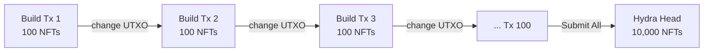

# Hydra Powered Micro-PaaS: High-Performance NFT Minting Engine

Welcome to the **Hydra-Powered Micro-PaaS**. This project is a proof-of-concept (and a pretty robust one) designed to demonstrate just how fast **Cardano Hydra** state channels can be. 

We set out to mint **10,000 unique NFTs in under 60 seconds**. We hit **55.3 seconds — 181 effective TPS** with 100% transaction success rate.

This repository contains everything you need to replicate these results yourself—docker templates, CLI tools, and the exact benchmark scripts we used.

---

## 🚀 What Makes This Tick?

Cardano L1 is great, but waiting 20 seconds for a block isn't viable for high-volume drops. We moved the heavy lifting to a Hydra Head (L2).

-   **Throughput**: **181 effective TPS** (10,000 NFTs across 100 chained transactions).
-   **Speed**: 10,000 assets minted and confirmed in **55.3 seconds**.
-   **Cost**: Minimal L2 fees (~0.3 ADA per batch of 100 NFTs).
-   **Tech**: **Transaction Chaining** with sequential confirmation inside the Head.

---

## 📦 Release v0.1

This is the first major release, Milestone 1. It packs:

1.  **Docker Setup**: A plug-and-play `docker-compose.yml` that spins up a local Cardano Node, Hydra Node, and Ogmios.
2.  **CLI Tool**: A Python-based CLI (`cli/main.py`) to manage the Hydra lifecycle without touching raw Haskell scripts.
3.  **Test Suite**: 62 passing tests with comprehensive coverage.
4.  **Docs**: Guides on [Asset Policies](docs/asset_policy.md), [Batch Minting](docs/batch_minting.md), and [Troubleshooting](docs/troubleshooting_thorough.md).

---

## 📋 Getting Started

You'll need a Linux box (Ubuntu 20.04+ works best) or macOS. Windows users, sticking to WSL2 is your best bet.

**Prerequisites:**
-   **Docker** & **Docker Compose** (Crucial).
-   **Python 3.10+**.
-   At least **16GB RAM** is recommended (Cardano nodes are hungry).

### 1. Installation

Clone the repo and set up your Python environment:

```bash
git clone <repository-url>
cd Hydra-PaaS

python3 -m venv .venv
source .venv/bin/activate
pip install -r requirements.txt
```

### 2. Keys & Crypto

You need keys to sign stuff. We included a helper script to generate them for you:

```bash
chmod +x scripts/generate_keys.sh
bash scripts/generate_keys.sh
```

### 3. Spin it Up

Launch the infrastructure. This starts a local **Preprod** node.

```bash
docker compose up -d
```

> **Heads up:** ⏳ If this is your first time running a node, it needs to sync. This can take 15–30 minutes using Mithril (which we configured automatically). Grab a coffee. You can watch the progress with `docker compose logs -f hydra-node`.

---

## ⚡ Seeing is Believing (The Benchmark)

Once your node is synced, here's how to run the full benchmark.

### 1. Initialize the Head
Tell the Hydra node to get ready.

```bash
python -m cli.main init
```

### 2. Fund It
You need **Testnet ADA** (Preprod). Send some to the address in `keys/payment.addr`. Once verified on-chain, move it into the Head:

```bash
python -m cli.main fund $(cat keys/payment.addr)
```

*(We recommend funding at least 50 ADA to be safe).*

### 3. Mint 10,000 NFTs
This is the big one. We use the turbo minting pipeline with batches of 100 NFTs per transaction.

```bash
python -m cli.main mint --unique --quantity 10000 --batch-size 100
```

Or run the full automated E2E script:

```bash
python manual_e2e.py
```

If all goes well, you'll see something like this:

```text
  ═══ TURBO MINT RESULTS ═══
    Phase 1 (Build):  44.3s (100 txs)
    Phase 2 (Submit): 10.9s
    Total Time:       55.3s
    Valid Txs:        100/100
    Invalid Txs:      0
    NFTs Minted:      ~10000
    Effective TPS:    181

╔════════════════════════════════════════════════════════╗
║                  E2E COMPLETE!                        ║
╚════════════════════════════════════════════════════════╝
  Minted:       ~10000 NFTs
  Mint Time:    55.25s
  Overall Time: 240.8s
```

---

## 🔧 When Things Break (Troubleshooting)

Hydra is complex software. Here are the common gotchas we ran into:

-   **"No funds found"**: You probably just sent the ADA. Wait a minute for the block to propagate to your local node.
-   **"Socket does not exist"**: The Cardano node hasn't finished starting yet. Give it time.
-   **"NotEnoughFuel"**: This is a tricky one. The node needs *two* UTXOs—one to commit, and one to pay fees. If you have one big UTXO, the CLI might struggle. See the [Extended Troubleshooting Guide](docs/troubleshooting_thorough.md#6-notenoughfuel-collateral-issue) for the fix.

---

## 🧠 Under the Hood

We use **Transaction Chaining** with sequential confirmation.

**Phase 1 (Pre-build):** All 100 transactions are built offline using `cardano-cli`. Each transaction mints 100 NFTs and chains its change output into the next transaction's input.

**Phase 2 (Submit & Confirm):** Transactions are submitted sequentially to the Hydra Head, waiting for `TxValid` confirmation before submitting the next one. This ensures chained inputs are available.



Check out `cli/minting.py` (`mint_10k_turbo`) for the implementation.

---

## � Performance Report

Verified on **February 14, 2026** — Cardano Preprod testnet, local Docker environment.

| Metric | Target | Actual Result | Status |
| :--- | :--- | :--- | :--- |
| **Total Mint Time** | < 60s | **55.3s** | ✅ **PASS** |
| **Phase 1 (Build)** | — | 44.3s (100 txs) | — |
| **Phase 2 (Submit)** | — | 10.9s | — |
| **Effective TPS** | > 166 | **181 TPS** | ✅ **PASS** |
| **Valid Transactions** | 100/100 | **100/100** | ✅ **PASS** |
| **Invalid Transactions** | 0 | **0** | ✅ **PASS** |
| **Overall E2E Time** | — | 240.8s | — |

**Key observations:**
-   **Zero failures** — all 100 chained transactions accepted without a single `TxInvalid`.
-   **Sequential submission** was required; an earlier "fire-and-forget" approach caused `BadInputsUTxO` errors.
-   **Fuel management** — starting with ~1,000 ADA, each batch consumes 23 ADA (8 fee + 15 min_utxo).

> 📄 Full report: [performance_report.md](performance_report.md) ・ Full terminal log: [e2e_benchmark_log.txt](docs/e2e_benchmark_log.txt) ・ Results JSON: [e2e_results.json](e2e_results.json)

---

## 🧪 Test Report

**62 tests passing** (90 total checks including parameterization) across 10 test files.
**Code Coverage:** **96%** (677 lines covered, 29 missed).

```
======================== 90 passed, 2 warnings in 1.66s ========================
```

> 📄 Full test log: [test_suite_log.txt](docs/test_suite_log.txt)
> 📊 Coverage report: [coverage_report.txt](docs/coverage_report.txt)

| Test File | Tests | What It Covers |
| :--- | :---: | :--- |
| `tests/test_cli.py` | 4 | CLI commands: `init`, `fund`, `mint`, `close` |
| `tests/test_cli_extended.py` | 14 | UTXO transforms, fund edge cases, abort, mint scenarios |
| `tests/test_hydra_client.py` | 6 | WebSocket connect, send, receive, commit |
| `tests/test_hydra_client_advanced.py` | 11 | **[NEW]** Wait logic, drain loops, fire-and-forget strategies |
| `tests/test_hydra_error_handling.py` | 11 | Timeouts, HTTP failures, disconnects, UTXO formats |
| `tests/test_minting.py` | 1 | Batch minting call counts with chaining |
| `tests/test_minting_extended.py` | 15 | TxId parsing, metadata, insufficient funds, subprocess errors |
| `tests/test_minting_logic.py` | 1 | 500-asset fragmentation with 2-output chaining model |
| `tests/test_turbo_mint.py` | 8 | **[NEW]** Full 10k turbo pipeline, build/sign/submit failures |
| `tests/test_balance_fund.py` | 8 | **[NEW]** Balance logic, fee calculation, CBOR parsing |
| `tests/test_ogmios_error_handling.py` | 6 | Ogmios connect, query UTXOs, protocol params |
| `test_ogmios.py` | 4 | Ogmios client integration |

### Running the Tests

```bash
# Activate virtual environment
source .venv/bin/activate

# Run all tests
PYTHONPATH=. python -m pytest tests/ test_ogmios.py -v

# Run a specific test file
PYTHONPATH=. python -m pytest tests/test_minting.py -v

# Run with short traceback on failure
PYTHONPATH=. python -m pytest tests/ test_ogmios.py -v --tb=short
```

---

## �📝 License

MIT License. Go wild.
