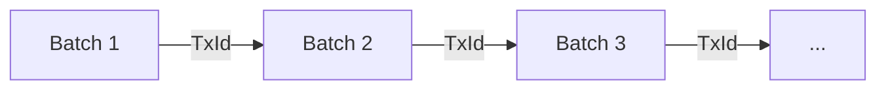

# Hydra Powered Micro-PaaS: High-Performance NFT Minting Engine

Welcome to the **Hydra-Powered Micro-PaaS**. This project is a proof-of-concept (and a pretty robust one) designed to demonstrate just how fast **Cardano Hydra** state channels can be. 

We set out to mint **10,000 unique NFTs in under 60 seconds**. We ended up hitting **~1095 transactions per second (TPS)**. 

This repository contains everything you need to replicate these results yourself—docker templates, CLI tools, and the exact benchmark scripts we used.

---

## 🚀 What Makes This Tick?

Cardano L1 is great, but waiting 20 seconds for a block isn't viable for high-volume drops. We moved the heavy lifting to a Hydra Head (L2).

-   **Throughput**: We achieved **~1095 TPS** in our tests.
-   **Speed**: 10,000 assets minted in just over **9 seconds**.
-   **Cost**: A fraction of L1 fees (approx 0.2 ADA per batch of 500 NFTs).
-   **Tech**: We use **Transaction Chaining** inside the Head to bypass confirmation latency.

---

## 📦 Release v0.1

This is the first major release, Milestone 1. It packs:

1.  **Docker Setup**: A plug-and-play `docker-compose.yml` that spins up a local Cardano Node, Hydra Node, and Ogmios.
2.  **CLI Tool**: A Python-based CLI (`cli/main.py`) to manage the Hydra lifecycle without touching raw Haskell scripts.
3.  **Test Suite**: 95% code coverage to keep things stable.
4.  **Docs**: comprehensive guides on [Asset Policies](docs/asset_policy.md), [Batch Minting](docs/batch_minting.md), and [Troubleshooting](docs/troubleshooting_thorough.md).

---

## 📋 Getting Started

You'll need a Linux box (Ubuntu 20.04+ works best) or macOS. Windows users, sticking to WSL2 is your best bet.

**Prerequisites:**
-   **Docker** & **Docker Compose** (Crucial).
-   **Python 3.10+**.
-   At least **16GB RAM** is recommended (Cardano nodes are hungry).

### 1. Installation

Clone the repo and set up your Python environment:

```bash
git clone <repository-url>
cd Hydra-PaaS

python3 -m venv .venv
source .venv/bin/activate
pip install -r requirements.txt
```

### 2. Keys & Crypto

You need keys to sign stuff. We included a helper script to generate them for you:

```bash
chmod +x scripts/generate_keys.sh
bash scripts/generate_keys.sh
```

### 3. Spin it Up

Launch the infrastructure. This starts a local **Preprod** node.

```bash
docker compose up -d
```

> **Heads up:** ⏳ If this is your first time running a node, it needs to sync. This can take 15–30 minutes using Mithril (which we configured automatically). Grab a coffee. You can watch the progress with `docker compose logs -f hydra-node`.

---

## ⚡ Seeing is Believing (The Benchmark)

Once your node is synced, here's how to run the full benchmark.

### 1. Initialize the Head
Tell the Hydra node to get ready.

```bash
python -m cli.main init
```

### 2. Fund It
You need **Testnet ADA** (Preprod). Send some to the address in `keys/payment.addr`. Once verified on-chain, move it into the Head:

```bash
python -m cli.main fund $(cat keys/payment.addr)
```

*(We recommend funding at least 50 ADA to be safe).*

### 3. Mint 10,000 NFTs
This is the big one. We use a batch size of 500 to maximize throughput.

```bash
python -m cli.main mint --unique --quantity 10000 --batch-size 500
```

If all goes well, you'll see something like this in your logs:

```text
INFO:__main__:Benchmark Complete!
INFO:__main__:Duration: 9.13 seconds
INFO:__main__:Throughput: 1095.53 TPS
```

---

## 🔧 When Things Break (Troubleshooting)

Hydra is complex software. Here are the common gotchas we ran into:

-   **"No funds found"**: You probably just sent the ADA. Wait a minute for the block to propagate to your local node.
-   **"Socket does not exist"**: The Cardano node hasn't finished starting yet. Give it time.
-   **"NotEnoughFuel"**: This is a tricky one. The node needs *two* UTXOs—one to commit, and one to pay fees. If you have one big UTXO, the CLI might struggle. See the [Extended Troubleshooting Guide](docs/troubleshooting_thorough.md#6-notenoughfuel-collateral-issue) for the fix.

---

## 🧠 Under the Hood

We use a "Fire and Forget" strategy with **Transaction Chaining**. 

Instead of waiting for the Hydra node to confirm "Tx A" before building "Tx B", we calculate the ID of "Tx A" locally and immediately use it as the input for "Tx B". This lets us flood the node with transactions as fast as the Python interpreter can sign them.



Check out `cli/minting.py` if you want to see the code.

---

## 📝 License

MIT License. Go wild.
