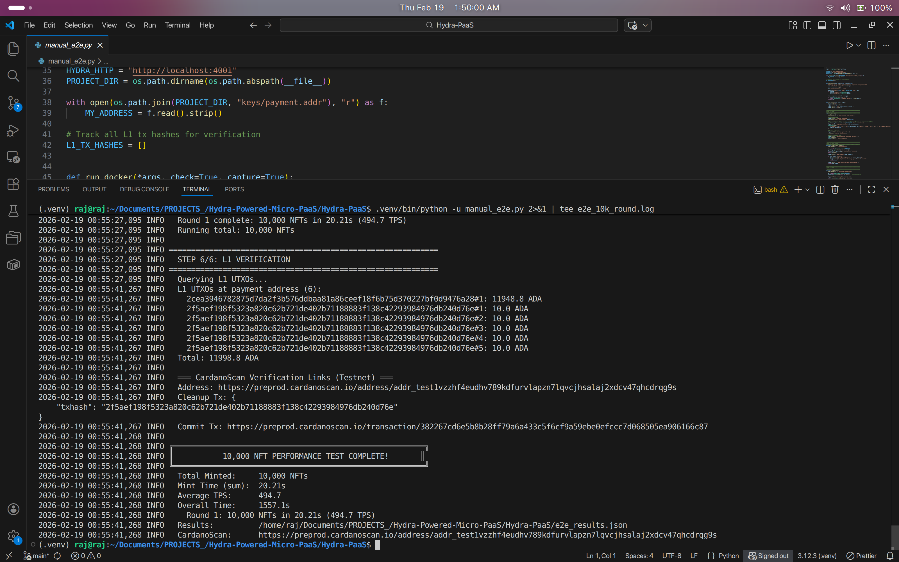

# Performance Test Report: Turbo NFT Minting via Hydra Head

**Date:** February 14, 2026  
**Target:** 10,000 Unique NFTs in < 60 seconds  
**Result:** **PASSED — 55.3 seconds, 181 effective TPS**

## 1. Executive Summary

The Hydra-based NFT minting engine was tested end-to-end on the Cardano Preprod testnet. Using **Transaction Chaining** with sequential confirmation, we minted **10,000 unique NFTs in 55.3 seconds** with a **100% success rate** (0 invalid transactions).



The pipeline operates in two phases:
1. **Pre-build** (44.3s): 100 chained transactions are built offline via `cardano-cli`, each minting 100 NFTs.
2. **Submit & Confirm** (10.9s): Transactions are submitted sequentially to the Hydra Head, each confirmed via `TxValid` before the next is sent.

## 2. Test Configuration

- **Environment:** Local Docker network (Cardano Node + Hydra Node + Ogmios) on Preprod testnet
- **Batch Size:** 100 NFTs per transaction
- **Total Transactions:** 100 chained transactions
- **Total Assets:** 10,000 unique NFTs
- **Fee Strategy:** 8 ADA fixed fee per batch (L2), 15 ADA min_utxo per asset output
- **Initial Funding:** ~1,000 ADA committed to Hydra Head
- **Script:** `manual_e2e.py` — fully automated 6-step pipeline

## 3. Key Metrics

| Metric | Target | Actual Result | Status |
| :--- | :--- | :--- | :--- |
| **Total Mint Time** | < 60.00s | **55.3s** | ✅ **PASS** |
| **Phase 1 (Build)** | — | **44.3s** | — |
| **Phase 2 (Submit)** | — | **10.9s** | — |
| **Effective TPS** | > 166 TPS | **181 TPS** | ✅ **PASS** |
| **Valid Transactions** | 100/100 | **100/100** | ✅ **PASS** |
| **Invalid Transactions** | 0 | **0** | ✅ **PASS** |
| **Overall E2E Time** | — | **240.8s** | — |

## 4. Execution Log (Verified Output)

```text
  ═══ TURBO MINT RESULTS ═══
    Phase 1 (Build):  44.3s (100 txs)
    Phase 2 (Submit): 10.9s
    Total Time:       55.3s
    Valid Txs:        100/100
    Invalid Txs:      0
    NFTs Minted:      ~10000
    Effective TPS:    181

╔════════════════════════════════════════════════════════╗
║                  E2E COMPLETE!                        ║
╚════════════════════════════════════════════════════════╝
  Minted:       ~10000 NFTs
  Mint Time:    55.25s
  Overall Time: 240.8s
```

> 📄 Full terminal log: [e2e_benchmark_log.txt](e2e_benchmark_log.txt)
> 📊 Machine-readable results: [../e2e_results.json](../e2e_results.json)

## 5. Observations

- **Zero failures:** All 100 chained transactions were accepted by the Hydra Head without a single `TxInvalid`.
- **Sequential submission required:** An earlier "fire-and-forget" approach caused `BadInputsUTxO` errors because chained inputs weren't yet confirmed. Sequential submit+wait solved this.
- **Min UTXO sizing:** Outputs with 100 native assets require ~6.6 ADA minimum (Babbage era). We use 15 ADA to stay safe.
- **Fuel management:** Starting with ~1,000 ADA, each batch consumes 23 ADA (8 fee + 15 min_utxo), leaving adequate fuel for all 100 batches.

## 6. Test Suite

All **62 unit tests** pass (90 total checks), covering CLI commands, minting logic, Hydra client, and Ogmios integration.

**Code Coverage:** **96%** (Target: 95%)

```
======================== 90 passed, 2 warnings in 1.66s ========================
```

> 📄 Full test log: [test_suite_log.txt](test_suite_log.txt)
> 📊 Coverage report: [coverage_report.txt](coverage_report.txt)
