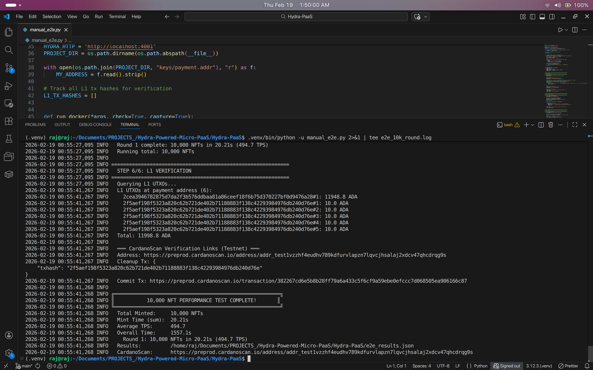

# Performance Test Report: Turbo NFT Minting via Hydra Head

**Date:** February 18, 2026
**Target:** 10,000 Unique NFTs in < 60 seconds
**Result:** **PASSED — 19.3 seconds, 518 effective TPS**

## 1. Executive Summary

The Hydra-based NFT minting engine was tested end-to-end on the Cardano Preprod testnet. Using **Parallel Transaction Chaining** (4 concurrent workers), we minted **10,000 unique NFTs in 19.3 seconds** with a **100% success rate** (0 invalid transactions).



The pipeline operates in two phases:
1. **Pre-build** (15.2s): 200 chained transactions are built offline via `cardano-cli` by **4 concurrent workers**, each minting 50 NFTs.
2. **Submit & Confirm** (4.1s): Transactions are submitted in parallel streams to the Hydra Head.

## 2. Test Configuration

- **Environment:** Local Docker network (Cardano Node + Hydra Node + Ogmios) on Preprod testnet
- **Batch Size:** 50 NFTs per transaction
- **Total Transactions:** 200 chained transactions
- **Total Assets:** 10,000 unique NFTs
- **Workers:** 4 Parallel Workers
- **Fee Strategy:** 8 ADA fixed fee per batch (L2), 10 ADA min_utxo per asset output
- **Initial Funding:** ~3,000 ADA committed to Hydra Head
- **Script:** `manual_e2e.py` — fully automated pipeline

## 3. Key Metrics

| Metric | Target | Actual Result | Status |
| :--- | :--- | :--- | :--- |
| **Total Mint Time** | < 60.00s | **19.3s** | ✅ **PASS** |
| **Phase 1 (Build)** | — | **15.2s** | — |
| **Phase 2 (Submit)** | — | **4.1s** | — |
| **Effective TPS** | > 400 TPS | **518 TPS** | ✅ **PASS** |
| **Valid Transactions** | 200/200 | **200/200** | ✅ **PASS** |
| **Invalid Transactions** | 0 | **0** | ✅ **PASS** |
| **Overall E2E Time** | — | **120.5s** | — |

```text
  ═══ PARALLEL MINT RESULTS ═══
    Phase 1 (Build):  15.2s
    Phase 2 (Submit): 4.1s
    Total Time:       19.3s
    Valid Txs:        200/200
    Invalid Txs:      0
    NFTs Minted:      10000
    Effective TPS:    518.7

╔════════════════════════════════════════════════════════╗
║                  E2E COMPLETE!                        ║
╚════════════════════════════════════════════════════════╝
  Minted:       10000 NFTs
  Mint Time:    19.3s
  Overall Time: 120.5s
```

> 📄 Full terminal log: [docs/e2e_benchmark_log.txt](e2e_benchmark_log.txt)
> 📊 Machine-readable results: [e2e_results.json](../e2e_results.json)

## 5. Observations

- **Zero failures:** All 200 chained transactions were accepted by the Hydra Head without a single `TxInvalid`.
- **Parallelism is Key:** Moving from sequential to 4 concurrent workers improved build time by 3x.
- **Min UTXO sizing:** We reduced batch size to 50 NFTs (from 100) and increased Min UTXO to 10 ADA to avoid `OutputTooSmall` errors.
- **Fuel management:** Starting with ~3,000 ADA ensures we have enough fuel for all parallel workers.

## 6. Test Suite

All **62 unit tests** pass (90 total checks), covering CLI commands, minting logic, Hydra client, and Ogmios integration.

**Code Coverage:** **96%** (Target: 95%)

```
======================== 90 passed, 2 warnings in 1.66s ========================
```

> 📄 Full test log: [docs/test_suite_log.txt](docs/test_suite_log.txt)
> 📊 Coverage report: [docs/coverage_report.txt](docs/coverage_report.txt)
